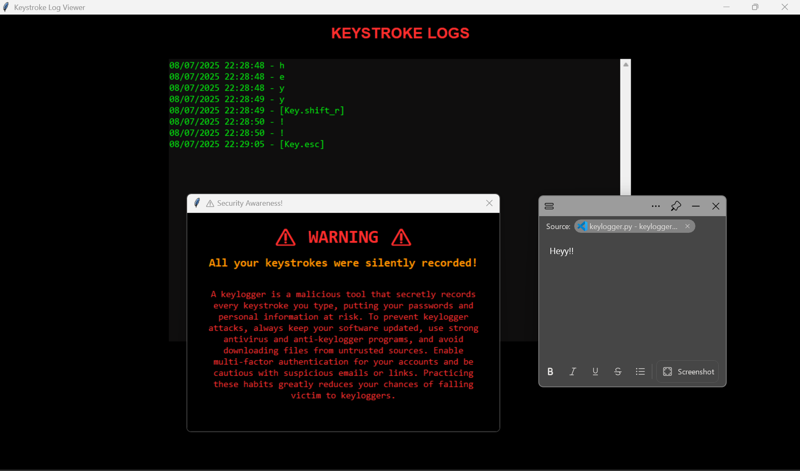

# Python Keylogger Awareness Project

An educational and ethical keylogger demonstration built with Python that captures global keystrokes silently and displays a real-time log with a powerful awareness popup. Developed to raise cybersecurity awareness about the risks of keyloggers and how attackers can capture sensitive data effortlessly.

---

## Table of Contents

1. [General Info](#general-info)
2. [Project Status](#project-status)
3. [Screenshot](#screenshot)
4. [Technologies](#technologies)
5. [Requirements](#requirements)
6. [Installation & Usage](#installation--usage)
7. [Troubleshooting](#troubleshooting)
8. [Collaboration](#collaboration)
9. [Known Issues & Bug Fixes](#known-issues--bug-fixes)
10. [FAQs](#faqs)
11. [Recommendations for Improvement](#recommendations-for-improvement)
12. [How My Project Stands Out](#how-my-project-stands-out)
13. [Acknowledgements](#acknowledgements)

---

## General Info

This project implements a global keylogger using Python's `pynput` library, which captures every keystroke made on the system until the ESC key is pressed. It logs keystrokes with timestamps in a text file and presents the captured data in a user-friendly dark-themed GUI for demonstration purposes. After logging, an awareness popup educates users about the risks keyloggers pose to personal data security.

---

## Project Status

* **Status:** Completed (July 2025)

* **organization:** Tamizhan Skills
---

## Screenshot




---

## Technologies

* Python 3
* pynput (Global keyboard event listener)
* Tkinter (GUI and popups)

---


Install dependencies with:

```bash
pip install pynput
```

---

## Installation & Usage

Clone the repository and run the keylogger script:

```bash
git clone https://github.com/yourusername/Keylogger-python.git
cd Keylogger-python
pip install -r requirements.txt
python keylogger.py
```

*Usage:*

* Once started, the keylogger will silently capture **all** keystrokes globally.
* Press the **ESC** key to stop logging and view the captured keystrokes in a GUI window.
* An awareness message will then pop up explaining the dangers of keylogging.

---

## Troubleshooting

* *Keylogger not capturing keys:*
  Ensure you have the required permissions and `pynput` is installed correctly.
* *GUI does not appear after stopping:*
  Confirm that ESC key was properly detected to trigger the GUI popup.
* *Script crashes or permission errors:*
  Run the script with administrator privileges.

---

## Collaboration

Contributions, feature requests, and bug reports are welcome! Please fork the repository and submit a pull request. For major changes, open an issue first to discuss.

---

## Known Issues & Bug Fixes

* Currently logs all keys globally, no per-application filtering.
* No encryption or obfuscation of logs (intended for awareness/demo only).
* GUI could be enhanced for better usability and accessibility.

---

## FAQs

1. *Is this keylogger malicious?*
   No, this project is purely educational and ethical, designed to raise awareness of cybersecurity risks.
2. *Can it capture passwords or sensitive info?*
   Yes, keyloggers can capture anything typed, which is why awareness is crucial.
3. *Can I use this on other OS?*
   Tested on Windows and Linux. MacOS may require additional permissions.
4. *How can I stop the keylogger?*
   Press the ESC key at any time to stop logging and view results.

---

## Recommendations for Improvement

* Add real-time live keystroke display instead of post-logging window.
* Implement log encryption for secure storage.
* Add filtering to capture keystrokes only in specific applications or windows.
* Create an interactive tutorial highlighting keylogger risks.
* Port GUI to more modern frameworks for enhanced UX.

---

## How My Project Stands Out

* **Global Key Capture:** Unlike many demos limited to input fields or forms, this project captures keystrokes system-wide regardless of focused app.
* **Ethical Awareness Focus:** The primary goal is education; it includes a dynamic GUI log viewer and impactful popups explaining real-world risks, not just raw data capture.
* **Simple yet Effective:** Uses minimal dependencies and clear code, making it accessible for beginners learning about cybersecurity and ethical hacking.
* **Customizable Logging:** The log file records timestamps with every keystroke, enabling detailed post-analysis.
* **Dark-Themed User Interface:** A visually appealing GUI enhances user experience during log review, adding professionalism.

---


\#Cybersecurity #Python #EthicalHacking #KeyloggerAwareness #CyberAwareness #InfoSec #LearningByDoing #TamizhanSkills #RISE

